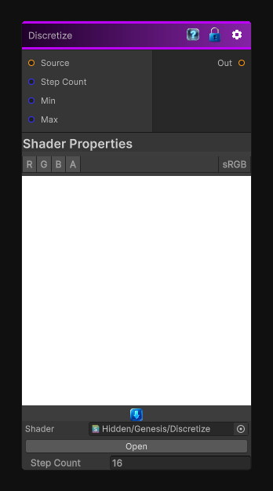

# Discretize

> This file is auto-generated by `Documentation/Generate-GenesisNodeDocs.ps1`.

[Back to index](../../README.md) | [Back to Operations](../../operations.md)

## Snapshot

## Details

- Menu: `Operations/Discretize`
- Node group: `Operations`
- Shader: `Hidden/Genesis/Discretize`
- Source: [Runtime/Nodes/Operations/DiscreetColorNode.cs](../../../../Runtime/Nodes/Operations/DiscreetColorNode.cs)

## Documentation

Round the color components to a specified number of steps in the image.
This node can also be used to make a posterize effect.

By default the input values are considered to be between 0 and 1, you can change these values in the node inspector to adapt the effect to your input data.
