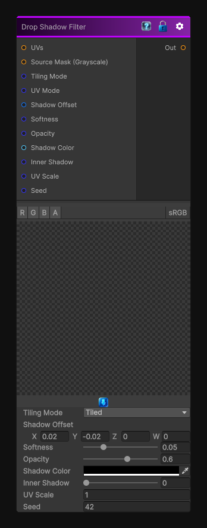

# Drop Shadow Filter

> This file is auto-generated by `Documentation/Generate-GenesisNodeDocs.ps1`.

[Back to index](../../README.md) | [Back to Operations](../../operations.md)

## Snapshot

## Details

- Menu: `Operations/Drop Shadow Filter`
- Node group: `Operations`
- Shader: `Hidden/Genesis/DropShadowFilter`
- Source: [Runtime/Nodes/Operations/DropShadowFilter.cs](../../../Doxygen/html/_drop_shadow_filter_8cs_source.html)

## Documentation

- Creates a soft, directional shadow behind any grayscale mask
- Adjustable offset, softness, opacity, color
- Optional inner shadow mode
- Fully procedural and CRT-safe
