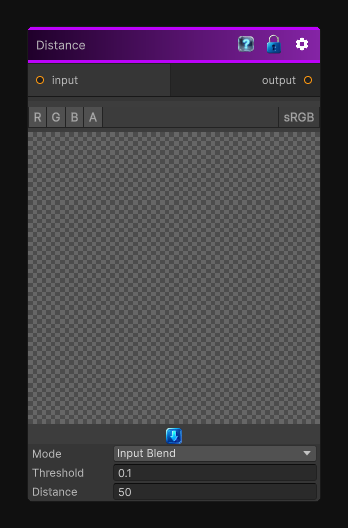

# Distance

> This file is auto-generated by `Documentation/Generate-GenesisNodeDocs.ps1`.

[Back to index](../../README.md) | [Back to Operations](../../operations.md)

## Snapshot

## Details

- Menu: `Operations/Fill`
- Node group: `Operations`
- Source: [Runtime/Nodes/Operations/ColorThresholdNode.cs](../../../Doxygen/html/_color_threshold_node_8cs_source.html)

## Documentation

Execute a flood fill operation on all pixels above the specified threshold.

Note that the computational cost of this node only depends on the texture resolution and not the distance parameter.

Smooth is only in alpha
