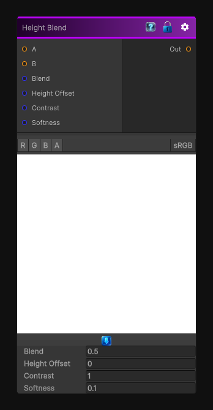

# Height Blend

> This file is auto-generated by `Documentation/Generate-GenesisNodeDocs.ps1`.

[Back to index](../../README.md) | [Back to Operations](../../operations.md)

## Snapshot

## Details

- Menu: `Operations/Height Blend`
- Node group: `Operations`
- Shader: `Hidden/Genesis/HeightBlend`
- Source: [Runtime/Nodes/Operations/HeightBlendNode.cs](../../../Doxygen/html/_height_blend_node_8cs_source.html)

## Documentation

Used for:
- Layered materials
- Height-aware masking
- Height-based compositing
- Smart material blending
- Weathering systems
- Terrain layering
