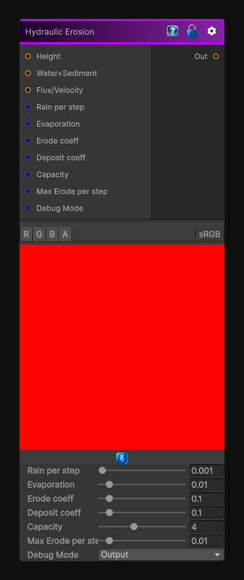

# Hydraulic Erosion

> This file is auto-generated by `Documentation/Generate-GenesisNodeDocs.ps1`.

[Back to index](../../README.md) | [Back to Operations](../../operations.md)

## Snapshot

## Details

- Menu: `Operations/Hydraulic Erosion`
- Node group: `Operations`
- Shader: `Hidden/Genesis/HydraulicErosion`
- Source: [Runtime/Nodes/Operations/HydraulicErosionNode.cs](../../../Doxygen/html/_hydraulic_erosion_node_8cs_source.html)

## Documentation

Simulates water-driven erosion to carve channels and soften the input heightmap or mask.
