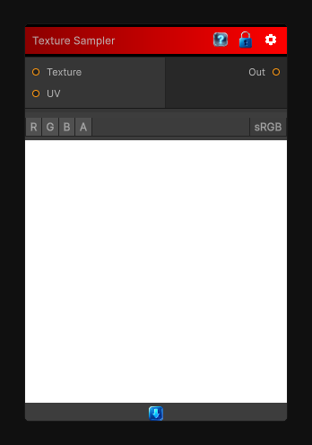

# Texture Sampler

> This file is auto-generated by `Documentation/Generate-GenesisNodeDocs.ps1`.

[Back to index](../../README.md) | [Back to Operations](../../operations.md)

## Snapshot

## Details

- Menu: `Operations/Textures/Texture Sampler`
- Shader: `Hidden/Genesis/TextureSample`
- Source: [Runtime/Nodes/Operations/TextureSamplerNode.cs](../../../Doxygen/html/_texture_sampler_node_8cs_source.html)

## Documentation

Sample a texture. Note that you can use a custom UV texture as well.
