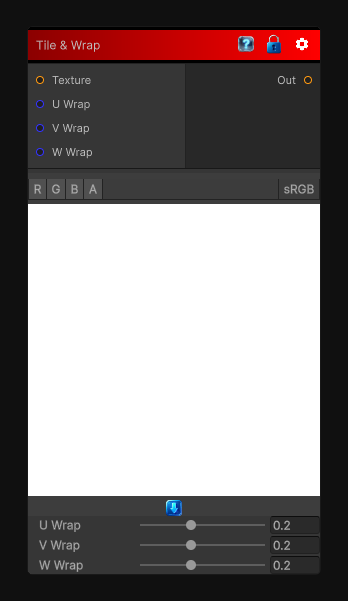

# Tile & Wrap

> This file is auto-generated by `Documentation/Generate-GenesisNodeDocs.ps1`.

[Back to index](../../README.md) | [Back to Operations](../../operations.md)

## Snapshot

## Details

- Menu: `Operations/Textures/Tile Wrap`
- Shader: `Hidden/Genesis/TileWrap`
- Source: [Runtime/Nodes/Operations/TileWrapNode.cs](../../../Doxygen/html/_tile_wrap_node_8cs_source.html)

## Documentation

Make the input texture tile by wrapping and blending the borders of the texture.
