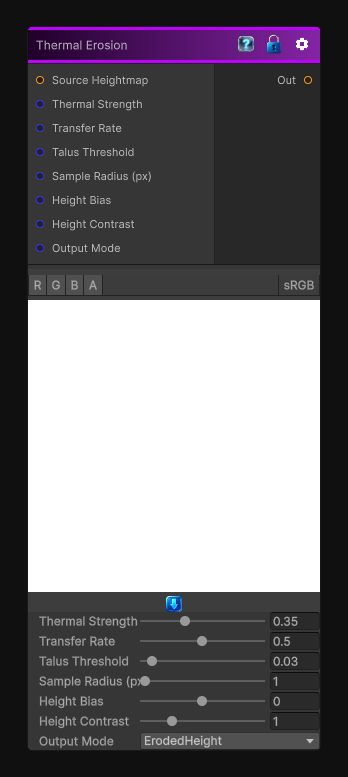

# Thermal Erosion

> This file is auto-generated by `Documentation/Generate-GenesisNodeDocs.ps1`.

[Back to index](../../README.md) | [Back to Operations](../../operations.md)

## Snapshot

## Details

- Menu: `Operations/Thermal Erosion`
- Node group: `Operations`
- Shader: `Hidden/Genesis/ThermalErosion`
- Source: [Runtime/Nodes/Operations/ThermalErosionNode.cs](../../../Doxygen/html/_thermal_erosion_node_8cs_source.html)

## Documentation

Applies thermal erosion to a heightmap by transferring material from steep cells to lower neighboring cells.

Use the talus threshold to control which slopes are considered unstable. The strength and transfer rate control how much material moves per pass, while the output mode can show the eroded height, removed material, deposited material, or local slope.
