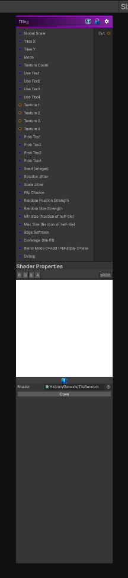

# Tiling

> This file is auto-generated by `Documentation/Generate-GenesisNodeDocs.ps1`.

[Back to index](../../README.md) | [Back to Operations](../../operations.md)

## Snapshot

## Details

- Menu: `Operations/Tile Random`
- Node group: `Operations`
- Shader: `Hidden/Genesis/TileRandom`
- Source: [Runtime/Nodes/Tiling/TilingNode.cs](../../../../Runtime/Nodes/Tiling/TilingNode.cs)

## Documentation

Tile a texture, both straight tiling or stochastic
