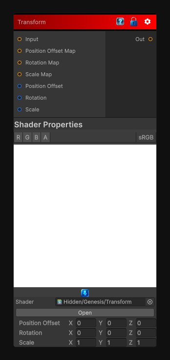

# Transform

> This file is auto-generated by `Documentation/Generate-GenesisNodeDocs.ps1`.

[Back to index](../../README.md) | [Back to Operations](../../operations.md)

## Snapshot

## Details

- Menu: `Operations/Transform`
- Shader: `Hidden/Genesis/Transform`
- Source: [Runtime/Nodes/Operations/TransformNode.cs](../../../../Runtime/Nodes/Operations/TransformNode.cs)

## Documentation

Apply a transformation on the input texture. This node allows you to offset, scale and rotate the input texture based on either another texture or a constant.

Note that the values from the rotation map will be converted to euler angles in the node so that 1 means 360 degree.
