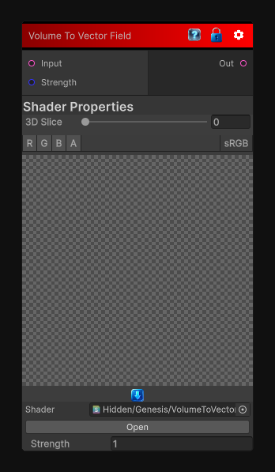

# Volume To Vector Field

> This file is auto-generated by `Documentation/Generate-GenesisNodeDocs.ps1`.

[Back to index](../../README.md) | [Back to Operations](../../operations.md)

## Snapshot

## Details

- Menu: `Operations/Volume To Vector Field`
- Shader: `Hidden/Genesis/VolumeToVectorField`
- Source: [Runtime/Nodes/Operations/VolumeToVectorFieldNode.cs](../../../../Runtime/Nodes/Operations/VolumeToVectorFieldNode.cs)

## Documentation

Converts a volume input into a vector field texture.
