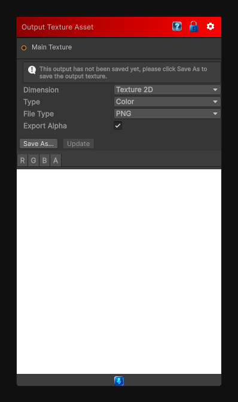

# External Output

> This file is auto-generated by `Documentation/Generate-GenesisNodeDocs.ps1`.

[Back to index](../../README.md) | [Back to Output](../../output.md)

## Snapshot

## Details

- Menu: `Output/External Output`
- Source: [Runtime/Nodes/ExternalOutputNode.cs](../../../Doxygen/html/_external_output_node_8cs_source.html)

## Documentation

Export a texture from the graph, the texture can also be exported outside of unity.

Note that for 2D textures, the file is exported either in png or exr depending on the current floating precision.
For 3D and Cube textures, the file is exported as a .asset and can be use in another Unity project.
