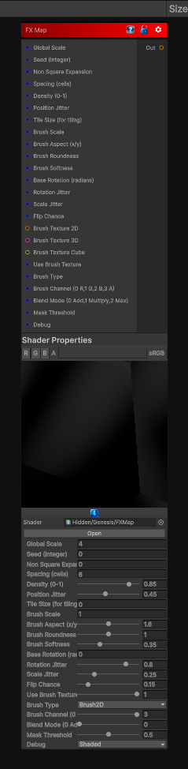

# FX Map

> This file is auto-generated by `Documentation/Generate-GenesisNodeDocs.ps1`.

[Back to index](../../README.md) | [Back to Tiling](../../tiling.md)

## Snapshot

## Details

- Menu: `Tiling/FX Map`
- Node group: `Tiling`
- Shader: `Hidden/Genesis/FXMap`
- Source: [Runtime/Nodes/Tiling/FXMapNode.cs](../../../../Runtime/Nodes/Tiling/FXMapNode.cs)

## Documentation

FX Map node behavior: it scatters oriented brush/shape stamps across the surface with controls for scale, spacing, rotation, jitter, density, brush shape, and layering, plus debug outputs (raw points, mask, orientation, shaded). It is deterministic, sampler-free, CRT-safe, supports non-square compensation, and includes a tiling-safe seed option pattern you can adapt.
