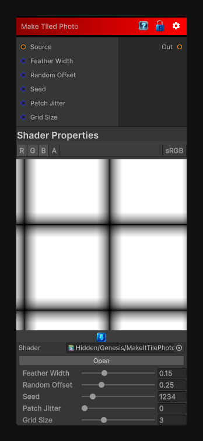

# Make Tiled Photo

> This file is auto-generated by `Documentation/Generate-GenesisNodeDocs.ps1`.

[Back to index](../../README.md) | [Back to Tiling](../../tiling.md)

## Snapshot

## Details

- Menu: `Tiling/Make Tiled Photo`
- Node group: `Tiling`
- Shader: `Hidden/Genesis/MakeItTilePhoto`
- Source: [Runtime/Nodes/Tiling/MakeTiledPhotoNode.cs](../../../../Runtime/Nodes/Tiling/MakeTiledPhotoNode.cs)

## Documentation

Ot's more advanced than Make Tiled because it performs:
- Multi-directional edge analysis
- Seam removal using mirrored borders
- Gradient-domain blending
- Optional random offset
- Optional patch-based jitter
- Fully seamless output even for photographic sources
- Mirrors the image at borders
- Blends seams using a gradient-domain feather
- Supports random offset
- Supports patch jitter
- Is deterministic and CRT-safe
