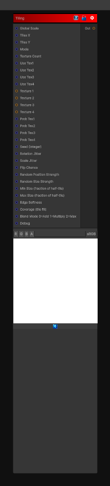

# Tiling

> This file is auto-generated by `Documentation/Generate-GenesisNodeDocs.ps1`.

[Back to index](../../README.md) | [Back to Tiling](../../tiling.md)

## Snapshot

## Details

- Menu: `Tiling/Tile Random`
- Node group: `Tiling`
- Shader: `Hidden/Genesis/TileRandom`
- Source: [Runtime/Nodes/Tiling/TilingNode.cs](../../../Doxygen/html/_tiling_node_8cs_source.html)

## Documentation

Tile a texture, both straight tiling or stochastic
