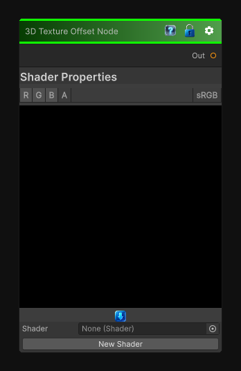

# 3D Texture Offset Node

> This file is auto-generated by `Documentation/Generate-GenesisNodeDocs.ps1`.

[Back to index](../../README.md) | [Back to Transform](../../transform.md)

## Snapshot

## Details

- Menu: `Transform/3D Texture Offset`
- Node group: `Transforms`
- Shader: `Hidden/Genesis/TextureOffset3D`
- Source: [Runtime/Nodes/Transforms/3DTexutreOffsetNode.cs](../../../../Runtime/Nodes/Transforms/3DTexutreOffsetNode.cs)

## Documentation

3D Texture Offset Color is a perfect utility node for volumetric workflows - it lets you shift a 3D texture in XYZ space and sample it at an offset
