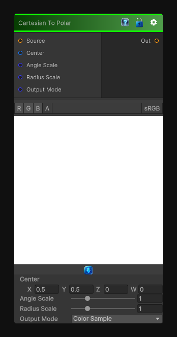

# Cartesian To Polar

> This file is auto-generated by `Documentation/Generate-GenesisNodeDocs.ps1`.

[Back to index](../../README.md) | [Back to Transform](../../transform.md)

## Snapshot

## Details

- Menu: `Transform/Cartesian To Polar`
- Node group: `Transforms`
- Shader: `Hidden/Genesis/CartesianToPolar`
- Source: [Runtime/Nodes/Transforms/CartesianToPolarNode.cs](../../../Doxygen/html/_cartesian_to_polar_node_8cs_source.html)

## Documentation

Cartesian -> Polar is one of those elegant coordinate-space transforms that unlocks entire families of procedural effects - radial gradients, spirals, polar warps, circular masks, kaleidoscopes, and more.
