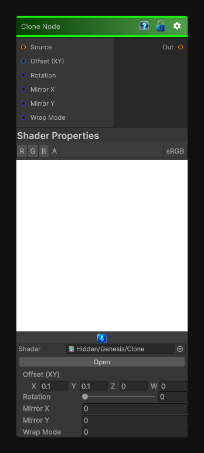

# Clone Node

> This file is auto-generated by `Documentation/Generate-GenesisNodeDocs.ps1`.

[Back to index](../../README.md) | [Back to Transform](../../transform.md)

## Snapshot

## Details

- Menu: `Transform/Clone`
- Node group: `Transforms`
- Shader: `Hidden/Genesis/Clone`
- Source: [Runtime/Nodes/Transforms/CloneNode.cs](../../../../Runtime/Nodes/Transforms/CloneNode.cs)

## Documentation

Sample from a shifted UV position, optionally with mirroring, rotation, offset, and wrap/clamp behavior. It's basically a UV-offset sampler with a few quality-of-life features.
