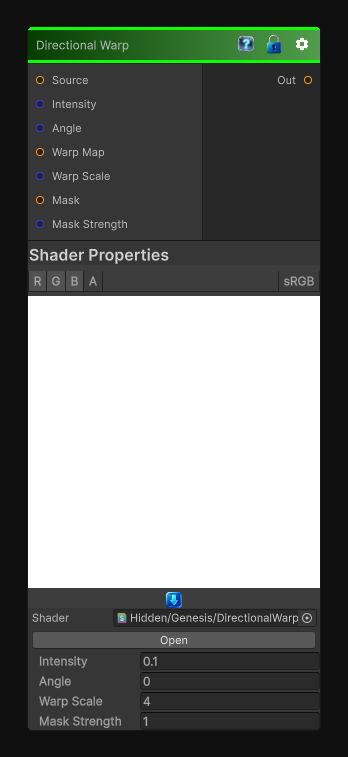

# Directional Warp

> This file is auto-generated by `Documentation/Generate-GenesisNodeDocs.ps1`.

[Back to index](../../README.md) | [Back to Transform](../../transform.md)

## Snapshot

## Details

- Menu: `Transform/Directional Warp`
- Node group: `Transforms`
- Shader: `Hidden/Genesis/DirectionalWarp`
- Source: [Runtime/Nodes/Transforms/DirectionalWarpNode.cs](../../../../Runtime/Nodes/Transforms/DirectionalWarpNode.cs)

## Documentation

Directional Warp = input warped along a direction, with intensity modulated by a grayscale map.

- Warp direction (angle)
- Warp intensity
- Warp scale
- Warp noise / pattern input
- UV-safe warping (no stretching artifacts)
- Deterministic, sampler-free warp field
