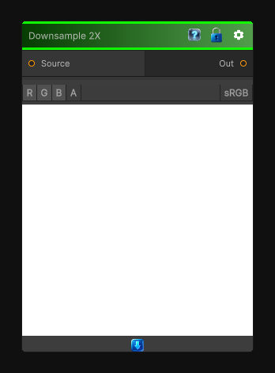

# Downsample 2X

> This file is auto-generated by `Documentation/Generate-GenesisNodeDocs.ps1`.

[Back to index](../../README.md) | [Back to Transform](../../transform.md)

## Snapshot

## Details

- Menu: `Transform/Downsample 2X`
- Node group: `Transforms`
- Shader: `Hidden/Genesis/Downsample2x`
- Source: [Runtime/Nodes/Transforms/Downsample2XNode.cs](../../../Doxygen/html/_downsample2_x_node_8cs_source.html)

## Documentation

Downsamples an input texture by 2x.
