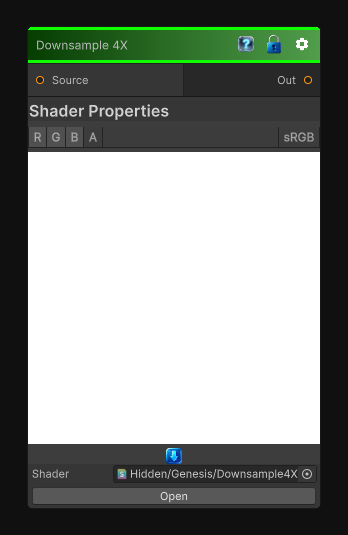

# Downsample 4X

> This file is auto-generated by `Documentation/Generate-GenesisNodeDocs.ps1`.

[Back to index](../../README.md) | [Back to Transform](../../transform.md)

## Snapshot

## Details

- Menu: `Transform/Downsample 4X`
- Node group: `Transforms`
- Shader: `Hidden/Genesis/Downsample4X`
- Source: [Runtime/Nodes/Transforms/Downsample4XNode.cs](../../../../Runtime/Nodes/Transforms/Downsample4XNode.cs)

## Documentation

Downsamples an input texture by 4x.
