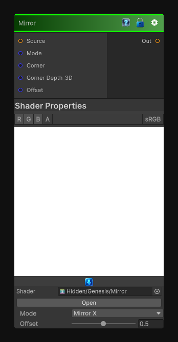

# Mirror

> This file is auto-generated by `Documentation/Generate-GenesisNodeDocs.ps1`.

[Back to index](../../README.md) | [Back to Transform](../../transform.md)

## Snapshot

## Details

- Menu: `Transform/Mirror`
- Node group: `Transforms`
- Shader: `Hidden/Genesis/Mirror`
- Source: [Runtime/Nodes/Transforms/MirrorNode.cs](../../../../Runtime/Nodes/Transforms/MirrorNode.cs)

## Documentation

- Reflect UVs across X and/or Y
- Optionally mirror around a custom center
- Wrap or clamp
- Deterministic, no derivatives
- Works for 2D / 3D / Cube textures
This is perfect for:
- Symmetry
- Pattern doubling
- Kaleidoscope bases
- Seam removal
- Procedural shape construction
