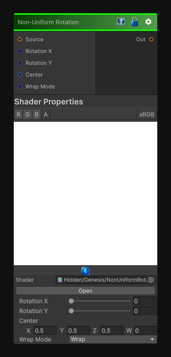

# Non-Uniform Rotation

> This file is auto-generated by `Documentation/Generate-GenesisNodeDocs.ps1`.

[Back to index](../../README.md) | [Back to Transform](../../transform.md)

## Snapshot

## Details

- Menu: `Transform/Non-Uniform Rotation`
- Node group: `Transforms`
- Shader: `Hidden/Genesis/NonUniformRotation`
- Source: [Runtime/Nodes/Transforms/NonUniformTransformNode.cs](../../../../Runtime/Nodes/Transforms/NonUniformTransformNode.cs)

## Documentation

Non-Uniform Rotation is a killer addition to your coordinate-space toolkit - it's the rotational equivalent of Non-Square Transform. Instead of scaling X and Y independently, we rotate UVs with different rotation angles per axis, producing:
- Anisotropic rotation
- Direction-dependent twisting
- Elliptical swirl effects
- Pre-warping for polar, kaleidoscope, and flow nodes
- Perfect for procedural shapes, noise, and patterns
