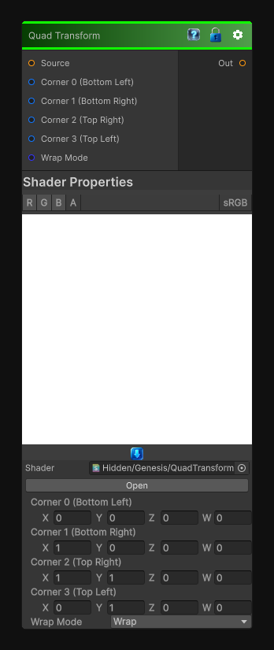

# Quad Transform

> This file is auto-generated by `Documentation/Generate-GenesisNodeDocs.ps1`.

[Back to index](../../README.md) | [Back to Transform](../../transform.md)

## Snapshot

## Details

- Menu: `Transform/Quad Transform`
- Node group: `Transforms`
- Shader: `Hidden/Genesis/QuadTransform`
- Source: [Runtime/Nodes/Transforms/QuadTransformNode.cs](../../../../Runtime/Nodes/Transforms/QuadTransformNode.cs)

## Documentation

Maps any quadrilateral -> any quadrilateral, which means:
- Perspective-correct warping
- Skewing, shearing, corner-pinning
- Mapping textures onto arbitrary 4-point shapes
- Undoing perspective distortion
- Preparing masks for projection, decals, UI, etc.
To recreate this in Genesis CRT, we need a bilinear quad mapping:
- Given UV (u, v)
- Map it into a quadrilateral defined by four corner points
- Sample the source texture at that warped coordinate
