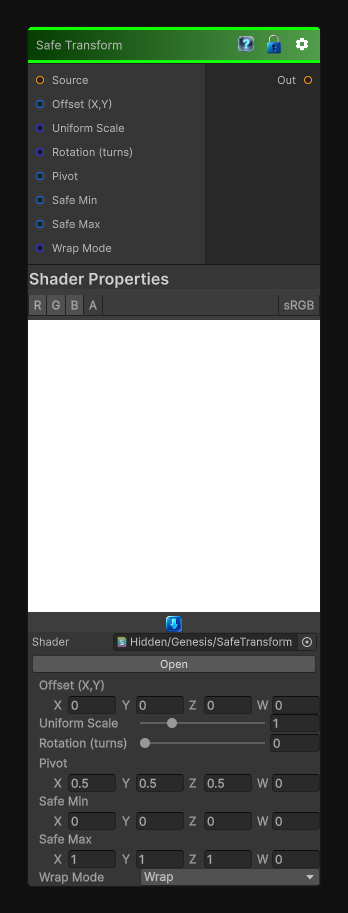

# Safe Transform

> This file is auto-generated by `Documentation/Generate-GenesisNodeDocs.ps1`.

[Back to index](../../README.md) | [Back to Transform](../../transform.md)

## Snapshot

## Details

- Menu: `Transform/Safe Transform`
- Node group: `Transforms`
- Shader: `Hidden/Genesis/SafeTransform`
- Source: [Runtime/Nodes/Transforms/SafeTransformNode.cs](../../../../Runtime/Nodes/Transforms/SafeTransformNode.cs)

## Documentation

The node you drop in when you want to transform UVs without ever breaking tiling, aspect ratio, or bounds. It's essentially a bounded, aspect-aware, non-destructive transform wrapper around:
- Translation
- Rotation
- Uniform scaling
- Optional pivot
- Optional safe-region clamping
The key idea:
No matter what transform you apply, the UVs stay inside 0-1 and never produce invalid sampling.
