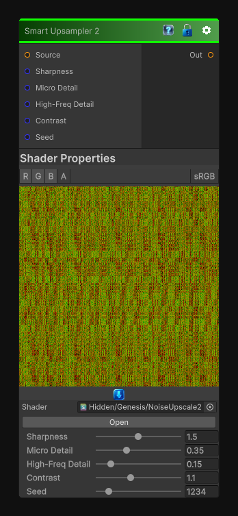

# Smart Upsampler 2

> This file is auto-generated by `Documentation/Generate-GenesisNodeDocs.ps1`.

[Back to index](../../README.md) | [Back to Transform](../../transform.md)

## Snapshot

## Details

- Menu: `Transform/Smart Upsampler 2`
- Node group: `Transforms`
- Shader: `Hidden/Genesis/NoiseUpscale2`
- Source: [Runtime/Nodes/Transforms/SmartUpsampler2Node.cs](../../../../Runtime/Nodes/Transforms/SmartUpsampler2Node.cs)

## Documentation

Smart Upsampler 2 is the natural evolution of Noise Upscale 1 - sharper, more contrast-preserving, and more structure-aware.
