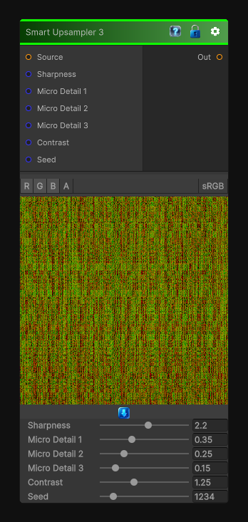

# Smart Upsampler 3

> This file is auto-generated by `Documentation/Generate-GenesisNodeDocs.ps1`.

[Back to index](../../README.md) | [Back to Transform](../../transform.md)

## Snapshot

## Details

- Menu: `Transform/Smart Upsampler 3`
- Node group: `Transforms`
- Shader: `Hidden/Genesis/NoiseUpscale3`
- Source: [Runtime/Nodes/Transforms/SmartUpsampler3Node.cs](../../../Doxygen/html/_smart_upsampler3_node_8cs_source.html)

## Documentation

Smart Upsampler 3 is the big-boy variant
- Ultra-sharp reconstruction
- High-frequency detail preservation
- Multi-octave micro-structure
- Stronger contrast shaping
- A more "procedural" upscale rather than photographic
