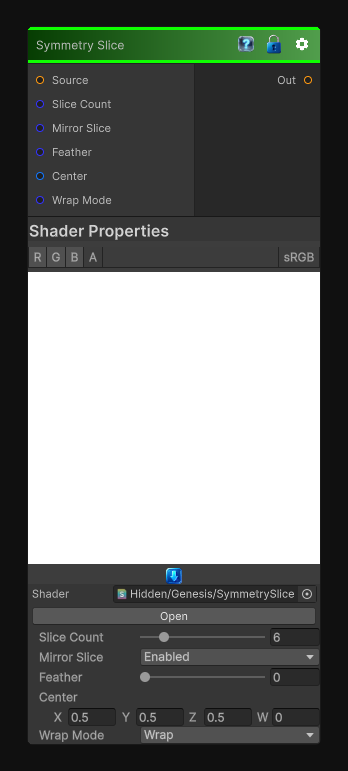

# Symmetry Slice

> This file is auto-generated by `Documentation/Generate-GenesisNodeDocs.ps1`.

[Back to index](../../README.md) | [Back to Transform](../../transform.md)

## Snapshot

## Details

- Menu: `Transform/Symmetry Slice`
- Node group: `Transforms`
- Shader: `Hidden/Genesis/SymmetrySlice`
- Source: [Runtime/Nodes/Transforms/SymmetrySliceNode.cs](../../../../Runtime/Nodes/Transforms/SymmetrySliceNode.cs)

## Documentation

Symmetry Slice is the designer's scalpel - the node that lets you carve the texture into angular wedges, mirror them, rotate them, and recombine them into kaleidoscope-like structures. It's the backbone of Genesis's:
- Kaleidoscope
- Radial patterning
- Mandala-style shapes
- Procedural flowers, gears, spokes
- Symmetry-driven masks
A proper Symmetry Slice node needs:
- Slice count (number of wedges)
- Slice angle
- Hard or soft slice boundaries
- Optional mirroring inside each slice
- Pivot control
- Wrap/clamp
- Deterministic, CRT-safe
