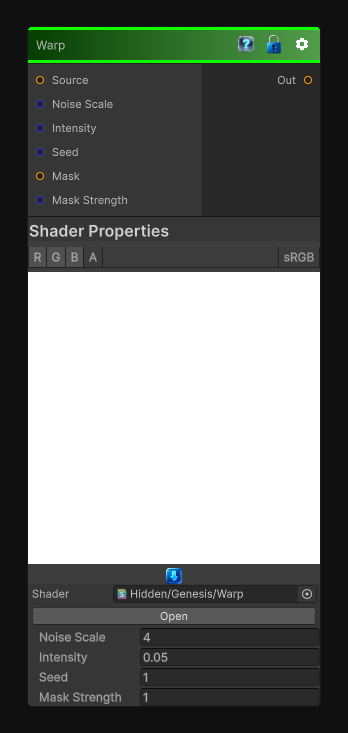

# Warp

> This file is auto-generated by `Documentation/Generate-GenesisNodeDocs.ps1`.

[Back to index](../../README.md) | [Back to Transform](../../transform.md)

## Snapshot

## Details

- Menu: `Transform/Warp`
- Node group: `Transforms`
- Shader: `Hidden/Genesis/Warp`
- Source: [Runtime/Nodes/Transforms/WarpNode.cs](../../../../Runtime/Nodes/Transforms/WarpNode.cs)

## Documentation

This is the Genesis Noise node that produces:
Organic smearing
Blobby distortions
Melting effects
Soft turbulence
Height-based warping

And it's distinct from Directional Warp or Vector Warp.
