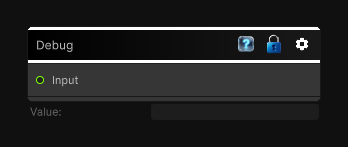

# Debug

> This file is auto-generated by `Documentation/Generate-GenesisNodeDocs.ps1`.

[Back to index](../../README.md) | [Back to Utility](../../utility.md)

## Snapshot

## Details

- Menu: `Utility/Debug`
- Node group: `Utility`
- Source: [Runtime/Nodes/DebugNode.cs](../../../Doxygen/html/_debug_node_8cs_source.html)

## Documentation

Inspects values during graph authoring and debugging.
