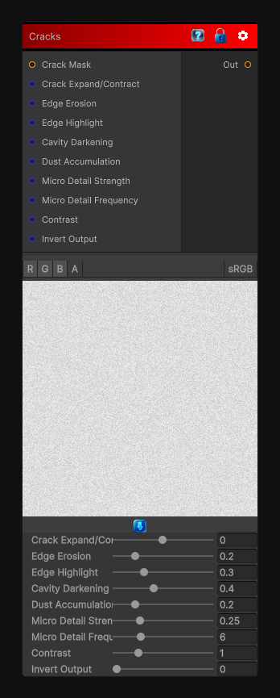

# Cracks

> This file is auto-generated by `Documentation/Generate-GenesisNodeDocs.ps1`.

[Back to index](../../README.md) | [Back to Wear](../../wear.md)

## Snapshot

## Details

- Menu: `Wear/Cracks`
- Node group: `Wear`
- Shader: `Hidden/Genesis/CracksWeathering`
- Source: [Runtime/Nodes/Wear/CracksWearNode.cs](../../../Doxygen/html/_cracks_wear_node_8cs_source.html)

## Documentation

- Extract crack lines from an input (usually height or mask)
- Expand or contract the cracks
- Add micro-erosion around crack edges
- Add cavity darkening
- Add edge brightening
- Add optional dust accumulation
- Output a clean mask or stylized crack map
