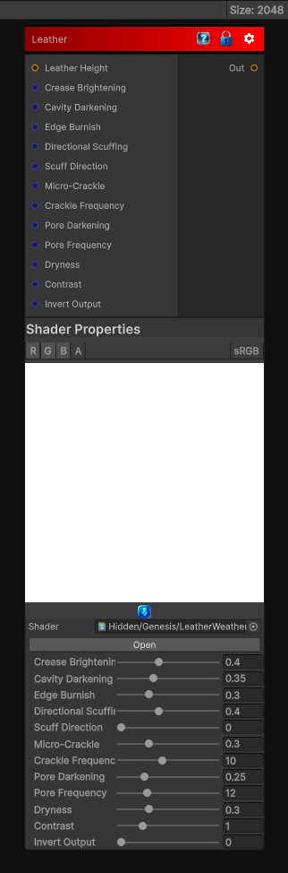

# Leather

> This file is auto-generated by `Documentation/Generate-GenesisNodeDocs.ps1`.

[Back to index](../../README.md) | [Back to Wear](../../wear.md)

## Snapshot

## Details

- Menu: `Wear/Leather`
- Node group: `Wear`
- Shader: `Hidden/Genesis/LeatherWeathering`
- Source: [Runtime/Nodes/Wear/LeatherWearNode.cs](../../../../Runtime/Nodes/Wear/LeatherWearNode.cs)

## Documentation

Leather has a very distinct wear signature compared to fabric or stone:
- 	Crease brightening
- 	Oil darkening in cavities
- 	Scuffing along direction of motion
- 	Crackle micro-cracks
- 	Edge burnishing
- 	Pore darkening
- 	Dryness (desaturation + roughness increase)
- 	Micro-grain breakup
We can simulate all of this in a single-pass, deterministic Genesis CRT node using:
- 	Analytic curvature
- 	Directional abrasion
- 	Micro-crackle noise
- 	Pore darkening
- 	Edge burnish
- 	Dryness shaping
