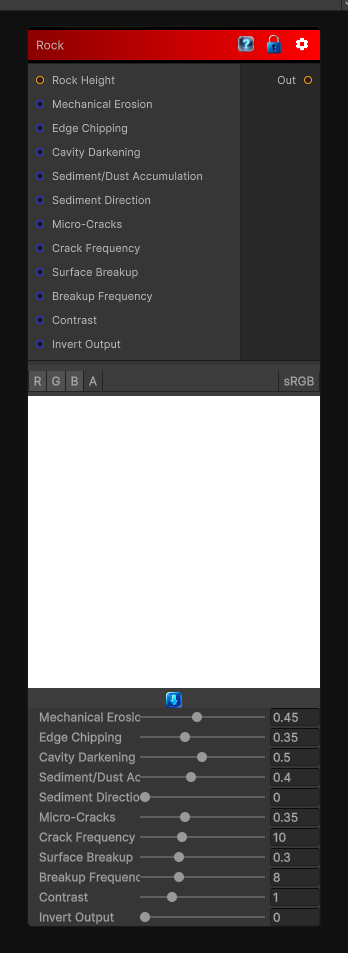

# Rock

> This file is auto-generated by `Documentation/Generate-GenesisNodeDocs.ps1`.

[Back to index](../../README.md) | [Back to Wear](../../wear.md)

## Snapshot

## Details

- Menu: `Wear/Rock`
- Node group: `Wear`
- Shader: `Hidden/Genesis/RockWeathering`
- Source: [Runtime/Nodes/Wear/RockWearNode.cs](../../../Doxygen/html/_rock_wear_node_8cs_source.html)

## Documentation

Rock Weathering is one of the most visually rewarding material effects you can add.  Rock ages through a combination of:
- Mechanical erosion (wind, water, abrasion)
- Chemical weathering (dissolution, oxidation)
- Cavity darkening
- Edge chipping
- Sediment/dust accumulation
- Micro-cracks
- Lichen/moss precursors
- Directional wear
