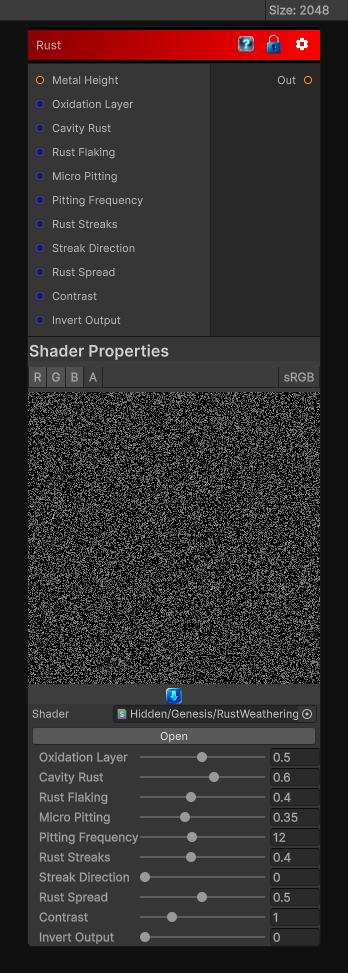

# Rust

> This file is auto-generated by `Documentation/Generate-GenesisNodeDocs.ps1`.

[Back to index](../../README.md) | [Back to Wear](../../wear.md)

## Snapshot

## Details

- Menu: `Wear/Rust`
- Node group: `Wear`
- Shader: `Hidden/Genesis/RustWeathering`
- Source: [Runtime/Nodes/Wear/RustWearNode.cs](../../../../Runtime/Nodes/Wear/RustWearNode.cs)

## Documentation

Rust Weathering is one of the most iconic, high-impact material effects in procedural texturing - and it's a perfect addition to your growing Material Weathering suite. Rust is not just "orange noise"; it forms through a combination of:
- Cavity moisture retention
- Surface oxidation
- Pitting corrosion
- Flaking and chipping
- Directional runoff
- Iron oxide bloom
- Micro-scale roughness increase
