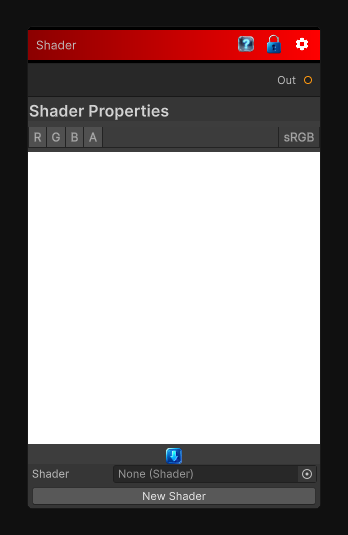

# Shader

> This file is auto-generated by `Documentation/Generate-GenesisNodeDocs.ps1`.

[Back to index](../../README.md) | [Back to Base Nodes](../../base-nodes.md)

## Snapshot

## Details

- Menu: `Base Nodes/Shader`
- Source: [Runtime/Nodes/ShaderNode.cs](../../../../Runtime/Nodes/ShaderNode.cs)

## Documentation

ShaderNode is the base class for all shader nodes in the Genesis Noise system.  This node will automatically show the shader properties as
        inputs that you can connect to other nodes.  It is used to create custom shader nodes that can be used in the noise generation process.
