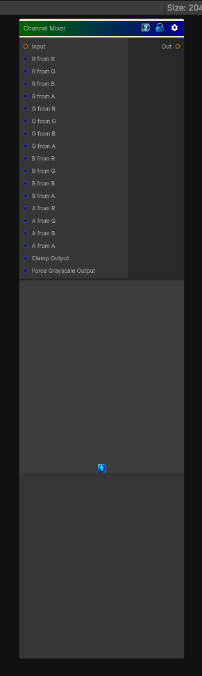

# Channel Mixer

> This file is auto-generated by `Documentation/Generate-GenesisNodeDocs.ps1`.

[Back to index](../../README.md) | [Back to Color](../../color.md)

## Snapshot

## Details

- Menu: `Color/Channel Mixer`
- Node group: `Color`
- Shader: `Hidden/Genesis/ChannelMixer`
- Source: [Runtime/Nodes/Color/ChannelMixerNode.cs](../../../../Runtime/Nodes/Color/ChannelMixerNode.cs)

## Documentation

- Supports RGB or RGBA input
- Per-channel mixing (R from RGB, G from RGB, B from RGB, A from RGBA)
- Optional clamping
- Optional grayscale output
- Fully deterministic
- CRT-safe
- Artist-friendly
