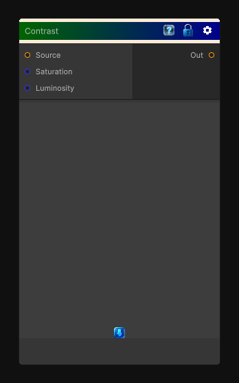

# Contrast

> This file is auto-generated by `Documentation/Generate-GenesisNodeDocs.ps1`.

[Back to index](../../README.md) | [Back to Color](../../color.md)

## Snapshot

## Details

- Menu: `Color/Contrast`
- Node group: `Color`
- Shader: `Hidden/Genesis/Contrast`
- Source: [Runtime/Nodes/Color/ContrastNode.cs](../../../../Runtime/Nodes/Color/ContrastNode.cs)

## Documentation

Adjusts the contrast of the source color by modifying its saturation and luminosity components.
