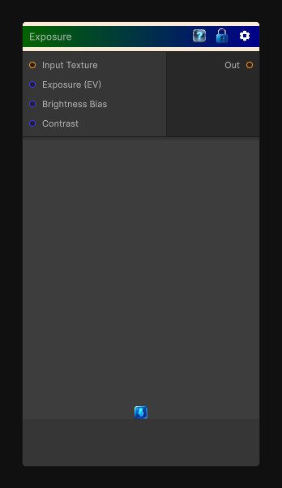

# Exposure

> This file is auto-generated by `Documentation/Generate-GenesisNodeDocs.ps1`.

[Back to index](../../README.md) | [Back to Color](../../color.md)

## Snapshot

## Details

- Menu: `Color/Exposure`
- Node group: `Color`
- Shader: `Hidden/Genesis/Exposure`
- Source: [Runtime/Nodes/Color/ExposureNode.cs](../../../../Runtime/Nodes/Color/ExposureNode.cs)

## Documentation

- Takes any input texture
- Applies exposure compensation (photographic EV)
- Uses the correct formula:
\mathrm{color_{\mathnormal{out}}}=\mathrm{color_{\mathnormal{in}}}\cdot 2^{\mathrm{exposure}}- Includes contrast and bias shaping for artistic control
