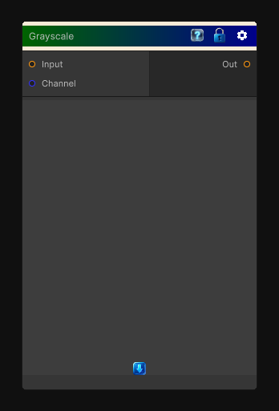

# Grayscale

> This file is auto-generated by `Documentation/Generate-GenesisNodeDocs.ps1`.

[Back to index](../../README.md) | [Back to Color](../../color.md)

## Snapshot

## Details

- Menu: `Color/Grayscale`
- Node group: `Color`
- Shader: `Hidden/Genesis/Grayscale`
- Source: [Runtime/Nodes/Color/GrayscaleNode.cs](../../../../Runtime/Nodes/Color/GrayscaleNode.cs)

## Documentation

Converts the input image to grayscale.

Use the `Algorithm` property to choose how the grayscale value is computed:

| Name | Description |
| --- | --- |
| Luminance | Uses the perceived luminance of the color. |
| Average | Uses the average of the RGB values. |
| Min/Max | Uses the minimum or maximum RGB value. |
| Desaturation | Uses the desaturation of the color. |
| One Channel | Uses a single RGB channel selected by the `Channel` property. |
| Gamma Corrected | Uses gamma-corrected RGB values. |
