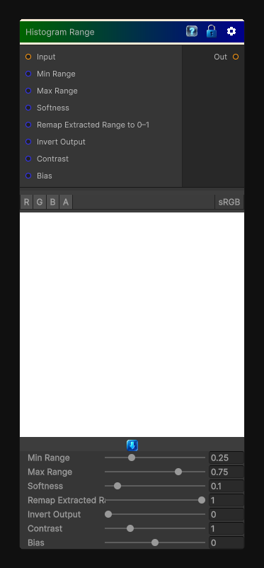

# Histogram Range

> This file is auto-generated by `Documentation/Generate-GenesisNodeDocs.ps1`.

[Back to index](../../README.md) | [Back to Color](../../color.md)

## Snapshot

## Details

- Menu: `Color/Histogram Range`
- Node group: `Color`
- Shader: `Hidden/Genesis/HistogramRange`
- Source: [Runtime/Nodes/Color/HistogramRangeNode.cs](../../../../Runtime/Nodes/Color/HistogramRangeNode.cs)

## Documentation

It's essentially a range remapper that:
- Extracts values inside a min/max range
- Softens edges
- Optionally inverts
- Optionally remaps the extracted range to 0-1
It's simpler than Histogram Scan or Equalize, but it's incredibly useful for:
- Mask isolation
- Range gating
- Stylized shading
- Procedural selection
- Driving palette or blend nodes
