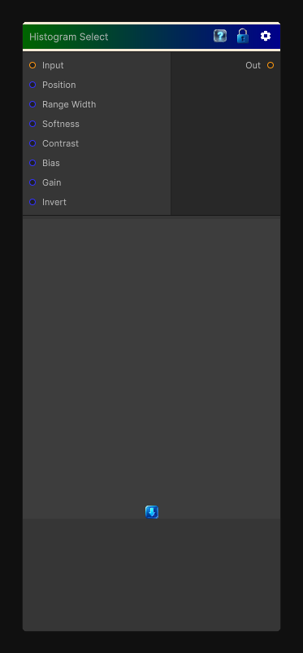

# Histogram Select

> This file is auto-generated by `Documentation/Generate-GenesisNodeDocs.ps1`.

[Back to index](../../README.md) | [Back to Color](../../color.md)

## Snapshot

## Details

- Menu: `Color/Histogram Select`
- Node group: `Color`
- Shader: `Hidden/Genesis/HistogramSelect`
- Source: [Runtime/Nodes/Color/HistogramSelectNode.cs](../../../../Runtime/Nodes/Color/HistogramSelectNode.cs)

## Documentation

It's basically a smart range selector that:
- Finds a value range inside the histogram
- Lets you slide that range across the histogram
- Lets you adjust width, position, and contrast
- Outputs a clean 0-1 mask
It's like Histogram Scan + Histogram Range, but with a movable window that selects a slice of the histogram.
