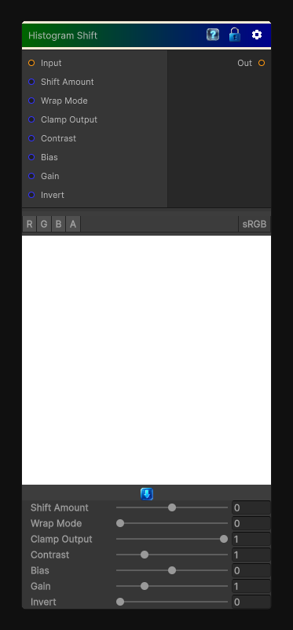

# Histogram Shift

> This file is auto-generated by `Documentation/Generate-GenesisNodeDocs.ps1`.

[Back to index](../../README.md) | [Back to Color](../../color.md)

## Snapshot

## Details

- Menu: `Color/Histogram Shift`
- Node group: `Color`
- Shader: `Hidden/Genesis/HistogramShift`
- Source: [Runtime/Nodes/Color/HistogramShiftNode.cs](../../../../Runtime/Nodes/Color/HistogramShiftNode.cs)

## Documentation

It doesn't extract a range or scan a threshold - instead, it shifts the entire histogram left or right, optionally wrapping or clamping, and optionally applying contrast shaping.
It's basically:
\mathrm{out}=\mathrm{saturate}(h+\mathrm{shift})
with optional:
- Wrap mode
- Clamp mode
- Contrast shaping
- Bias/Gain shaping
