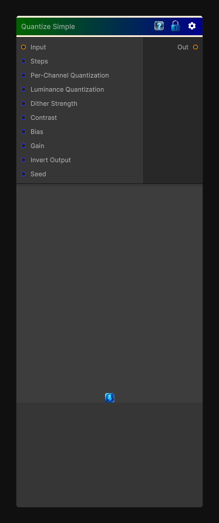

# Quantize Simple

> This file is auto-generated by `Documentation/Generate-GenesisNodeDocs.ps1`.

[Back to index](../../README.md) | [Back to Color](../../color.md)

## Snapshot

## Details

- Menu: `Color/Quantize Simple`
- Node group: `Color`
- Shader: `Hidden/Genesis/QuantizeColorSimple`
- Source: [Runtime/Nodes/Color/QuantizeSimpleNode.cs](../../../../Runtime/Nodes/Color/QuantizeSimpleNode.cs)

## Documentation

Quantize Color (Simple) is one of the most useful for stylization, posterization, toon shading, palette reduction, and mask creation. The Substance version does exactly this:
- Take an RGB input
- Convert to luminance or operate per-channel
- Quantize into N discrete steps
- Optionally remap back to 0-1
- Output the quantized color
The "Simple" version in Substance is literally:
\mathrm{quantized}=\frac{\mathrm{round}(v\cdot N)}{N}
Where N is the number of steps.
