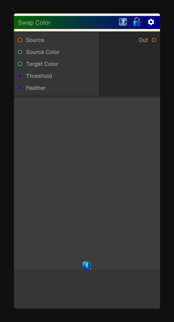

# Swap Color

> This file is auto-generated by `Documentation/Generate-GenesisNodeDocs.ps1`.

[Back to index](../../README.md) | [Back to Color](../../color.md)

## Snapshot

## Details

- Menu: `Color/Replace Color`
- Node group: `Color`
- Shader: `Hidden/Genesis/ColorSwap`
- Source: [Runtime/Nodes/Color/ColorSwapNode.cs](../../../../Runtime/Nodes/Color/ColorSwapNode.cs)

## Documentation

Replace the source color by the target color in the image.
