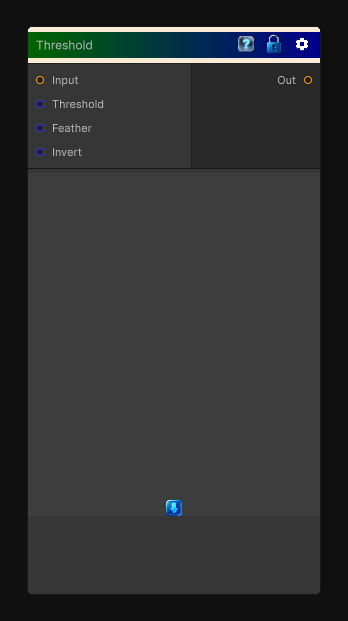

# Threshold

> This file is auto-generated by `Documentation/Generate-GenesisNodeDocs.ps1`.

[Back to index](../../README.md) | [Back to Color](../../color.md)

## Snapshot

## Details

- Menu: `Color/Threshold`
- Node group: `Color`
- Shader: `Hidden/Genesis/Threshold`
- Source: [Runtime/Nodes/Color/ThresholdNode.cs](../../../../Runtime/Nodes/Color/ThresholdNode.cs)

## Documentation

Apply a threshold value to a channel of the input texture and output the result. You can use the Feather parameter to smooth the step.
