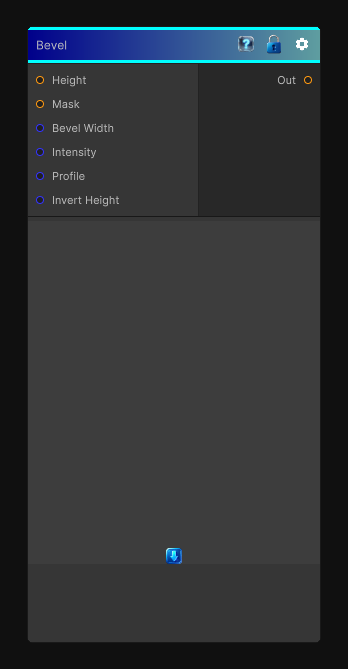

# Bevel

> This file is auto-generated by `Documentation/Generate-GenesisNodeDocs.ps1`.

[Back to index](../../README.md) | [Back to Effects](../../effects.md)

## Snapshot

## Details

- Menu: `Effects/Bevel`
- Node group: `Effects`
- Shader: `Hidden/Genesis/Bevel`
- Source: [Runtime/Nodes/Effects/Effects/BevelNode.cs](../../../../Runtime/Nodes/Effects/Effects/BevelNode.cs)

## Documentation

- 	A height-to-normal conversion
- 	Followed by normal integration
- 	Followed by lighting-style shading (usually lambertian or half-lambert)
- 	With optional width, smoothness, and profile shaping
