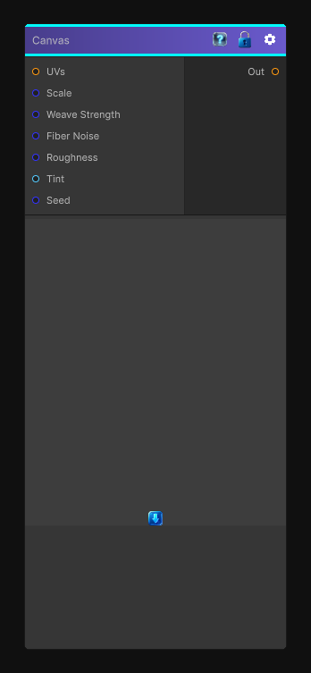

# Canvas

> This file is auto-generated by `Documentation/Generate-GenesisNodeDocs.ps1`.

[Back to index](../../README.md) | [Back to Effects](../../effects.md)

## Snapshot

## Details

- Menu: `Effects/Canvas`
- Node group: `Modifiers`
- Shader: `Hidden/Genesis/CanvasTexture`
- Source: [Runtime/Nodes/Filters/Artistic/CanvasNode.cs](../../../../Runtime/Nodes/Filters/Artistic/CanvasNode.cs)

## Documentation

- Paper/canvas fiber grain
- Directional weave (warp/weft)
- Micro-roughness
- Pigment catch (paint settling into fibers)
- Optional color tinting
