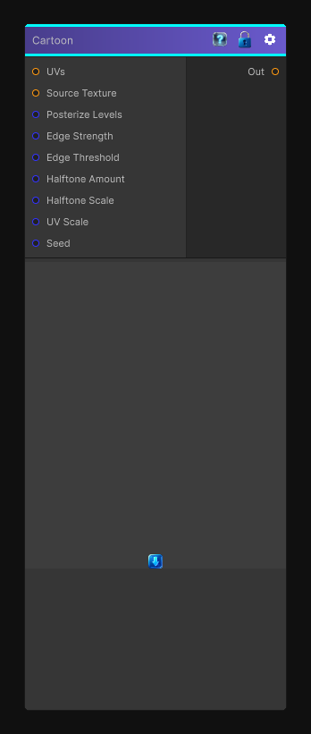

# Cartoon

> This file is auto-generated by `Documentation/Generate-GenesisNodeDocs.ps1`.

[Back to index](../../README.md) | [Back to Effects](../../effects.md)

## Snapshot

## Details

- Menu: `Effects/Cartoon`
- Node group: `Modifiers`
- Shader: `Hidden/Genesis/CartoonFilter`
- Source: [Runtime/Nodes/Filters/Artistic/CartoonFilterNode.cs](../../../../Runtime/Nodes/Filters/Artistic/CartoonFilterNode.cs)

## Documentation

- Edge detection (Sobel-style)
- Color quantization (toon shading)
- Posterization
- Optional halftone dots
