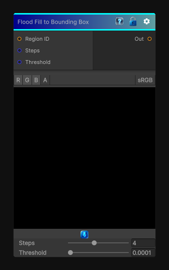

# Flood Fill to Bounding Box

> This file is auto-generated by `Documentation/Generate-GenesisNodeDocs.ps1`.

[Back to index](../../README.md) | [Back to Effects](../../effects.md)

## Snapshot

## Details

- Menu: `Effects/Flood Fill to Bounding Box`
- Node group: `Effects`
- Shader: `Hidden/Genesis/FloodFillToBoundingBox`
- Source: [Runtime/Nodes/Effects/Effects/FloodFillToBoundingBoxNode.cs](../../../../Runtime/Nodes/Effects/Effects/FloodFillToBoundingBoxNode.cs)

## Documentation

Flood Fill to Bounding Box does three things:
- Finds the min/max UV extents of each region
- Normalizes the pixel's position inside that bounding box
- Outputs a 0-1 coordinate inside the region's box
- R = normalized X
- G = normalized Y
- B = region size (optional)
To do this in a single-pass CRT shader, we use a hash-based pseudo-bounding-box estimator that is stable and deterministic
