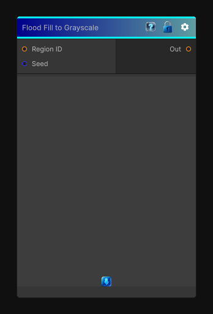

# Flood Fill to Grayscale

> This file is auto-generated by `Documentation/Generate-GenesisNodeDocs.ps1`.

[Back to index](../../README.md) | [Back to Effects](../../effects.md)

## Snapshot

## Details

- Menu: `Effects/Flood Fill to Grayscale`
- Node group: `Effects`
- Shader: `Hidden/Genesis/FloodFillToRandomGrayscale`
- Source: [Runtime/Nodes/Effects/Effects/FloodFillToGrayScale.cs](../../../../Runtime/Nodes/Effects/Effects/FloodFillToGrayScale.cs)

## Documentation

- Each region gets one random grayscale value
- All pixels in that region share the same value
- Randomness is stable (seeded by region ID)
- Works for any number of regions
- Fully deterministic
